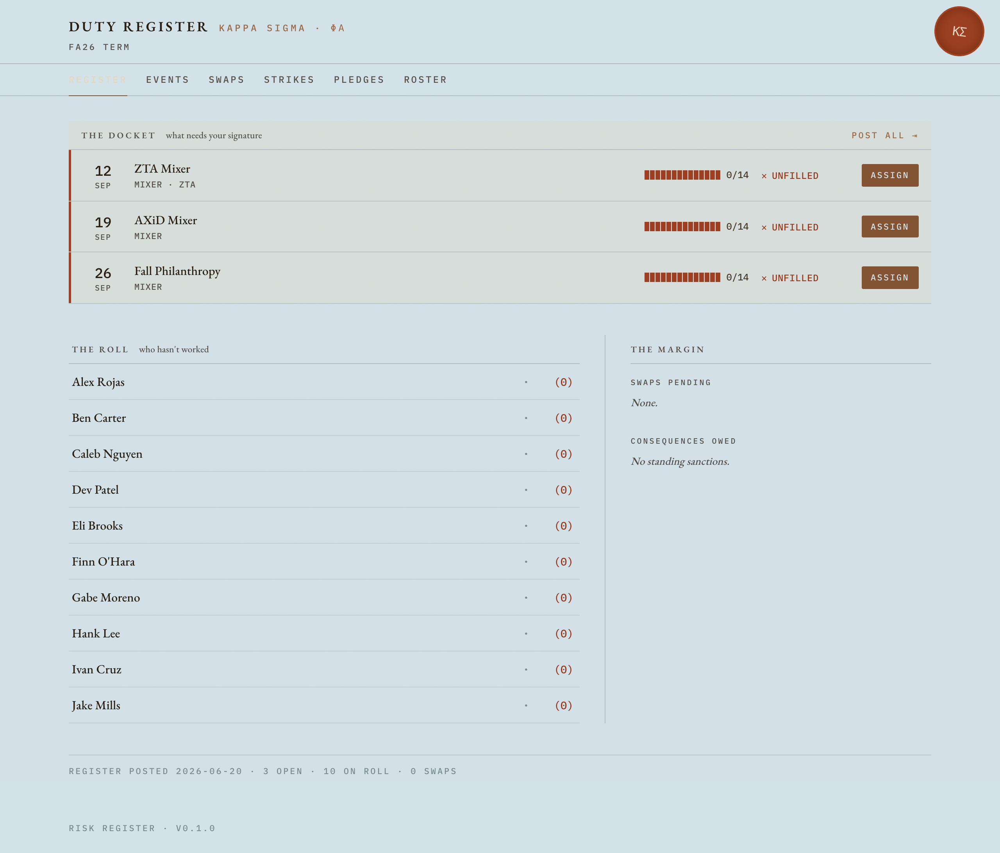
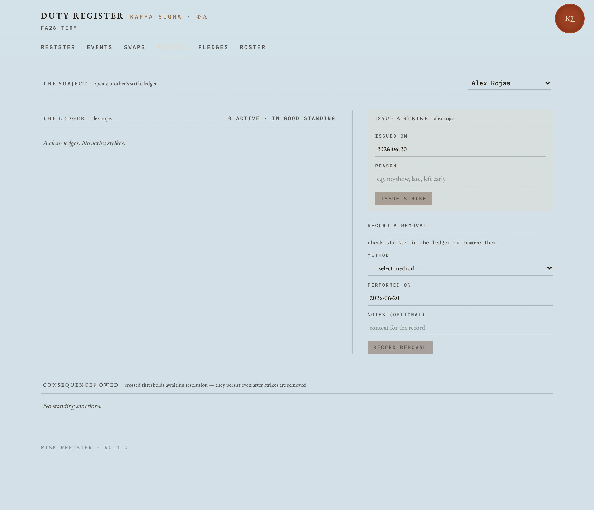
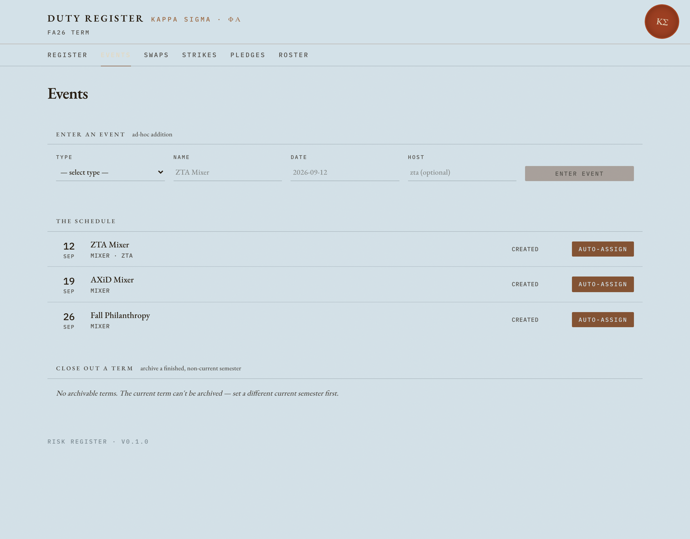

<div align="center">
  
  <h1>Risk Management</h1>
  <p><strong>Sober-monitor shift assignment + strike tracking for the risk chair of Kappa Sigma Phi-Alpha.</strong></p>
  <p><em>A single-user, offline-first desktop app. Your data never leaves your Mac.</em></p>
</div>

---

This app does the two jobs a fraternity risk chair actually has to do every week:

1. **Staff events.** Every party/function needs sober monitors. The app tracks events, figures out
   who's eligible, and **auto-assigns shifts fairly** (so the same people don't get stuck every time).
2. **Track discipline.** It keeps each member's **strike ladder** — who has how many strikes, what
   consequences they've crossed (probation, expulsion review), and how strikes get resolved.

It runs as a native macOS app you open from the Dock. No terminal, no browser, no login, no server —
everything is local SQLite on your machine.

<div align="center">
  
  
  <br/>
  <sub>The dashboard ("Duty Register") and a member's strike ledger. The "Duty Ledger" design —
  brass for actions, oxblood for alarms.</sub>
</div>

## Table of contents
- [Quick start](#quick-start)
- [Core concepts](#core-concepts)
- [A typical term, start to finish](#a-typical-term-start-to-finish)
- [The command line](#the-command-line)
- [How it's built (for contributors)](#how-its-built-for-contributors)
- [Project layout](#project-layout)
- [Development](#development)
- [Building the native app](#building-the-native-app)
- [Tech stack & conventions](#tech-stack--conventions)

## Quick start

### Just use the app (recommended)
The app is installed at `/Applications/Risk Management.app` — open it from the Dock, or:
```sh
open "/Applications/Risk Management.app"
```
It opens a native window straight to the dashboard. On first run it creates an empty database at
`~/Library/Application Support/risk-management/risk.db`; your next step is to
[import a roster](#1-import-the-roster).

### Run from source (developers)
Requires [`uv`](https://docs.astral.sh/uv/) (Python) and Node. Two processes in dev — a backend API
and the Vite frontend with hot reload:
```sh
# 1. (optional) seed a demo database so you have something to look at
uv run python scripts/seed_demo.py /tmp/risk-demo.db

# 2. backend API on http://127.0.0.1:8000
RISK_DB_PATH=/tmp/risk-demo.db uv run python -m risk.api

# 3. in another terminal — frontend on http://localhost:5173 (proxies /api to the backend)
cd web && npm install && npm run dev
```
Open http://localhost:5173. *(The native app collapses these two into one process — see
[Building the native app](#building-the-native-app).)*

## Core concepts

The whole app is built from a few nouns. In plain terms:

| Concept | What it is |
|---|---|
| **Semester** | A term, e.g. `FA26`. Exactly one is *current*. Old terms get *archived* at the end. |
| **Member** | A brother or pledge. Imported from your roster (a Google-Form CSV export). |
| **House** | A host house an event belongs to. |
| **Event** | A function that needs sober monitors — has a date, a host house, and a *type*. |
| **Event type** | A template (e.g. "mixer") that carries the default number of monitor shifts. |
| **Shift** | One monitor slot on an event, assigned to one member. |
| **Auto-assign** | Fills open shifts automatically, balancing the load and respecting eligibility. It can explain *why* it picked each person (a dry-run preview). |
| **Strike** | A disciplinary mark on a member, numbered per term. Crossing thresholds triggers **consequences** (e.g. probation, expulsion review). Strikes are *removed* via a method, never silently deleted. |
| **Swap** | A member-initiated shift trade — take someone's shift, or move to an open slot. States: `open → accepted / rejected / cancelled`. |
| **Pledge mode** | Per-house policy for *who* staffs an event: pledges-only, mixed, or brothers-only — with automatic downgrade when there aren't enough pledges. |

## A typical term, start to finish

#### 1. Import the roster
Export your member roster from the Google Form as a CSV (columns: `Full Name, Rising Class, PC, EC`),
then:
```sh
uv run risk ingest gform-roster roster.csv --semester FA26 --dry-run   # preview the changes
uv run risk ingest gform-roster roster.csv --semester FA26            # apply them
```
This creates members, derives each one's class year, records their pledge class, and marks exec-council
members. *(You can also do this in the app on the **Roster** tab.)*

#### 2. Create events and assign shifts
Add events (in the app's **Events** tab, or via the API/CLI). Each event type brings default monitor
shifts. Then **auto-assign** to fill them — fairly, and with a preview of who got what and why.

#### 3. Run the term
- **Swaps** — members request shift trades; you accept/reject from the Swaps tab.
- **Strikes** — issue strikes on the **Strikes** tab; the app tracks the ladder and surfaces any
  **consequences owed** when a member crosses a threshold. Resolve them, or record a strike removal.

#### 4. Archive the term
At the end, archive the semester. The app guards this: it won't let you archive the current term or
one with unresolved items, and it carries open strikes forward to the next term.

#### Importing strikes in bulk (two-tier ingest)
Strike sheets come in messy (a pasted table, a PDF, a screenshot). The flow is two-tier:
1. **Tier 1** — Claude parses the messy source into a clean JSON file (the canonical schema).
2. **Tier 2** — apply it: `uv run risk ingest strike-sheet strikes.json` (idempotent — safe to re-run).

The roster CSV skips Tier 1 because it's already structured.

## The command line

Everything the app does is also a CLI command — handy for scripting or inspecting state. All commands
honor `RISK_DB_PATH`.
```sh
uv run risk --help                    # all command groups
uv run risk semester list             # terms
uv run risk member list               # roster
uv run risk event list                # events
uv run risk strike --help             # issue / remove / inspect strikes
uv run risk swap --help               # shift swaps
```
Groups: `config · db · semester · member · event · shift · strike · unavailability · swap · ingest`.

## How it's built (for contributors)

A clean, strictly-layered architecture. Each layer only talks to the one below it (enforced by
import-linter):

```
web/ (React SPA)
   │  HTTP /api
   ▼
src/risk/api/      FastAPI — routers, request/response schemas, error mapping
   ▼
src/risk/services/ the brains — all business rules live here
   ▼
src/risk/repos/    thin SQL, one module per table
   ▼
src/risk/db/       SQLite connection, schema, migrations
```

- **The frontend never contains business logic** — it calls the API. Rules (strike thresholds,
  fairness, pledge-mode resolution, archive guards) live in `src/risk/services/` and are the single
  source of truth.
- **The API serves the frontend too.** In the packaged app, FastAPI serves the built React bundle
  *same-origin*, so the whole thing is one process on one port — no CORS, no separate web server.
- **Everything is local SQLite** in WAL mode. No network calls, no accounts, no cloud.

<div align="center">
  
  <br/><sub>The Events tab: the schedule, per-event shifts, host changes, and auto-assign.</sub>
</div>

## Project layout
```
risk-management/
├── src/risk/
│   ├── api/          FastAPI app: app.py (factory), routers/, schemas.py, deps.py, errors.py
│   ├── services/     business logic: assignment, eligibility, fairness, policy, strike_state,
│   │                 swaps, pledge_mode, shift_requirements, semester_archive, ingest
│   ├── repos/        SQL per table
│   ├── db/           connection.py, schema.py, migrations/*.sql
│   ├── cli/          the `risk` command-line app (Typer)
│   └── desktop/      the native-window launcher (pywebview)
├── web/              React + Vite + TypeScript + Tailwind frontend
│   └── src/
│       ├── pages/    Dashboard, Events, Strikes, Swaps, PledgeTakeover, Roster
│       ├── lib/      api.ts (typed API client), types.ts
│       └── components/ledger.tsx   the "Duty Ledger" design primitives
├── packaging/        PyInstaller spec + icon + build docs for the native app
├── scripts/          seed_demo.py
└── tests/            backend test suite
```

## Development
```sh
uv sync                          # install Python deps
cd web && npm install            # install frontend deps

# quality gates (keep all green)
uv run pytest -q                 # full backend test suite
uv run ruff check . && uv run mypy src/risk
cd web && npx tsc -b             # frontend typecheck
```
**Heads up:** the backend does not hot-reload. After editing Python, restart `python -m risk.api`
(check for a stale server with `lsof -nP -iTCP:8000 -sTCP:LISTEN`). The frontend (Vite) hot-reloads.

## Building the native app
The desktop app is the React frontend wrapped in a native macOS window
([pywebview](https://pywebview.flowrl.com/)) with the FastAPI backend frozen alongside it by
[PyInstaller](https://pyinstaller.org/) — one self-contained `.app`, no Python install required to run it.
```sh
cd web && npm run build && cd ..                       # build the frontend
uv run pyinstaller packaging/RiskManagement.spec \
  --distpath packaging/dist --workpath packaging/build --noconfirm
# then install + ad-hoc sign (no paid Apple cert needed for personal use)
rm -rf "/Applications/Risk Management.app"
cp -R "packaging/dist/Risk Management.app" "/Applications/Risk Management.app"
codesign --force --deep --sign - "/Applications/Risk Management.app"
```
A locally-built bundle carries no quarantine flag, so it launches with no Gatekeeper prompt. Full
details (icon regeneration, troubleshooting) are in [`packaging/README.md`](packaging/README.md).

## Tech stack & conventions
- **Backend:** Python 3.12, FastAPI, SQLite (WAL), [`uv`](https://docs.astral.sh/uv/)-managed. Typed
  with mypy (strict), linted with ruff.
- **Frontend:** React + Vite + TypeScript + Tailwind v4. The **"Duty Ledger"** design is locked:
  no cards or status pills, hairline rules, tabular mono numerals, **brass = primary action, oxblood
  = alarm**, EB Garamond + IBM Plex Mono. Design tokens in `web/src/index.css`, primitives in
  `web/src/components/ledger.tsx`.
- **Desktop:** pywebview + PyInstaller.
- **Scope:** single-user, single-machine, localhost-only by design — no auth or multi-user support.

---

<sub>Built for the risk chair of Kappa Sigma Phi-Alpha (Ewing, NJ). Personal project — not affiliated
with any university.</sub>
